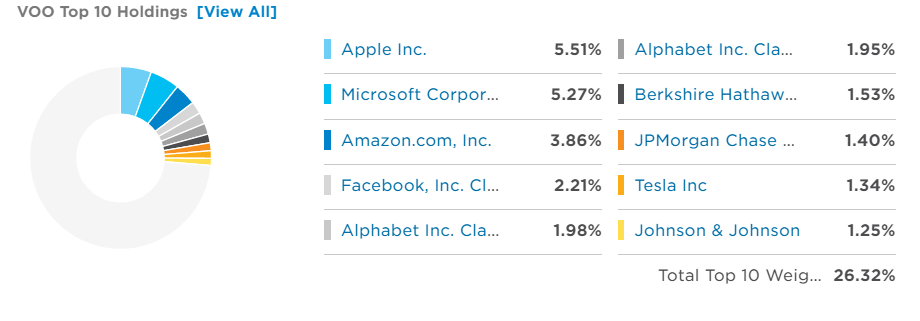
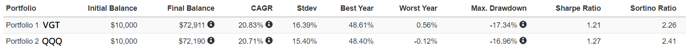

```python
import pandas as pd
from yahooquery import Ticker


# sector weightings, returns pandas DataFrame

def get_ETF_info(ETF):
    t = Ticker(ETF)
    df_holdings=pd.DataFrame(t.fund_holding_info[ETF]['holdings'])
    hold_type=t.fund_holding_info[ETF]['sectorWeightings']
    name=[[*type_][0] for type_ in hold_type]
    ratio=[type_[[*type_][0]] for type_ in hold_type]
    df_type=pd.DataFrame({"name":name,"ratio":ratio}).sort_values('ratio', ascending=False).reset_index(drop=True)
    return df_holdings,df_type
#df_holdings,df_type=get_ETF_info('VOO')
#df_holdings

def get_risk_data(datas,ETF):
    data=datas[ETF]['riskOverviewStatistics']['riskStatistics']
    temp_data={'name':ETF}
    for ele in data:
        temp_data[ele['year']+'_beta']=ele['beta']
        temp_data[ele['year']+'_stdDev']=ele['stdDev']
    return temp_data
def get_return_risk_data(ETFs=["VOO","VTI","VGT","QQQ","VT","VXUS"]):
    t = Ticker(ETFs)
    datas=t.fund_performance
    return_data=[]
    risk_data=[]
    for ETF in datas:
        if not 'No fundamentals data' in datas[ETF]:
            temp_data=datas[ETF]['trailingReturns']
            temp_data['name']=ETF
            return_data.append(temp_data)
            risk_data.append(get_risk_data(datas,ETF))
        
    df=pd.DataFrame(return_data).drop(['asOfDate','lastBullMkt','lastBearMkt'],axis=1)
    df=df[df.columns.tolist()[-1:]+df.columns.tolist()[:-1]]
    
    df_risk=pd.DataFrame(risk_data)
    return df,df_risk

def get_profile_data(ETFs=["VOO","VTI","VGT","QQQ","VT","VXUS"]):
    t = Ticker(ETFs)
    stats=t.quote_type
    profiles=t.fund_profile
    profile_li=[]
    for ETF in ETFs:
        if ETF != "VOO":
            expense_ratio=profiles[ETF]['feesExpensesInvestment']['annualReportExpenseRatio']
        else:
            expense_ratio=0.0003        
        profile_li.append({"name":ETF,"start_date": stats[ETF]['firstTradeDateEpochUtc'],"expense_ratio":expense_ratio})
    df=pd.DataFrame(profile_li)
    return df
def visualize_df(df):
    th_props = [
      ('font-size', '16px'),
      ]

    # Set CSS properties for td elements in dataframe
    td_props = [
      ('font-size', '16px')
      ]

    # Set table styles
    styles = [
      dict(selector="th", props=th_props),
      dict(selector="td", props=td_props)
      ]
    return df.style.highlight_max().highlight_min(color="red").set_table_styles(styles)
```


<span style="font-size:2.5em;margin:auto; display:table;">ETF portfolio asset allocation note</span>

**Outline:**
- 投資方式
- 資產配置
- 投入方式
- 參考資料
---

# 投資方式

## 複委託
透過國內券商向海外券商下單，會有較高的手續費但不需額外再開立一海外券商的證券帳號。適合一次性投入，不適合做定期定額等分批次進場的投資方式。建議投資標的會是債券相關的ETF。

- 優點:開戶相對簡單；操作介面為中文(較熟悉)；操作較為簡便。
- 缺點:手續費高；可能會有匯差問題(若短時間內不會換回台幣，可暫時忽略此項問題)。

### 注意
- 永豐有開定期定額手續費減免的服務。
- 找有QI資格的券商，債券ETF的配息免扣繳配息(股息)30%稅款。

### 推薦券商
- 永豐:線上即可完成所有開戶流程，開戶時間成本低，手續費相對便宜。
- 元大:現有的證券商且有QI資格。


### 海外券商

# 資產配置

## 美國

**優點:**
- 在過去10年有非常漂亮的股市表現
- 有較好的收益率

**缺點:**
- 股市波動較大
- 交易相對台股交易麻煩


**投資標的:**
- VOO:追蹤S&P500
- VTI:全美股市
- VGT:科技產業相關ETF
- QQQ:追蹤納斯達克100(Nasdaq-100 Index)

### VOO
- 追蹤標普500指數。
- 主要持股




- 持股類別


### VTI
- 季配息，每年配息約1-2%，主要是吃股價收益
- 追蹤CRSP US Total Market Index，Total Market，囊括美國股市大、中、小型以及微型股，可以完全反映美國股票市場的整體報酬
- 主要持股


- 產業分布


### VGT
- 資訊科技類股ETF(VGT)
- 追蹤MSCI US Investable Market Information Technology 25/50 Index


- 主要持股


- 產業分布


### QQQ
- 追蹤「納斯達克 100 指數」
- 年化報酬率高
- 持有的股票類型較VGT有較高的多樣性
- 主要持股


- 產業分布


## 全球

**優點**:
- 投資全球分散單一投資於同一地區的風險
- 有較低的價格波動率，相對美國股市較平穩

**缺點:**
- 收益率較單純投資美國股市差

**投資標的:**
- VT:追蹤全球股市
- VXUS:投資除美國以外的7000多家公司

### VT
- 絕大多數的投資還是在美國佔比57%
- 地區分布

- 

- 主要持股


- 產業分布

- 

### VXUS
- 投資美國以外的市場
- 有7000多檔股票
- 地區分布


- 主要持股


- 產業分布


## ETF比較

### VTI 和 VOO 比較

兩者的差異性不大，可以說VTI追蹤的美國股市較為全面。但是S&P500的公司佔據了美國百分之80的市值，所以VOO的表現與VTI差不多。另外兩者在費用率上兩者都是0.03%幾乎可以忽略不計，同質性的SPY則有0.0945%的費用率，所以在投資美國股市上直接從VOO或VTI選擇其中一種即可。


### VGT 和 QQQ 比較

會考慮這兩檔ETF主要是因為美國股市主要帶來較高報酬的都是資訊科技或是硬體相關的公司。單從回報率來看就大贏追蹤美國大盤的ETF(VOO、VTI)，而且其實VOO和VTI內科技相關的公司占比也超過20%，主要持有的大公司其實也都很接近只是比重占整體的比例不太一樣。另外從風險報酬比來看(Sharpe Ratio)以科技為主的ETF(VGT、QQQ)表現都是好過追蹤美股大盤的ETF(VOO、VTI)；再者從只考慮負報酬率的風險評估指標(Sortino ratio)來說科技相關的ETF還是有比追蹤大盤的ETF有更好的表現。如果再看到過去10年最大的回檔和最差的收益年份來說科技相關的ETF最大回檔約是在17%左右但是大盤相關的會到20%且有更差的最差年回報率。總和以上的條件我會覺得科技相關的ETF是值得考慮投資的標的。主要的缺點就是費用率稍高，約落在0.1%(VGT)和0.2%(QQQ)左右。




### 費用率比較
在費用率上不管是美國國內產業的ETF或是海外的ETF都是Vanguard集團的ETF有較好的費用率(V開頭的ETF)，且身為世界第二大的基金管理公司在倒閉清算的風險相對較低，在流動性上挑選出的這幾隻ETF也都非常不錯。所以以這幾隻ETF來做為投資標的是沒有太大問題的。


```python
visualize_df(get_profile_data())
```


<style  type="text/css" >
    #T_89cb1724_f09d_11eb_890f_5ed15da7e1cd th {
          font-size: 16px;
    }    #T_89cb1724_f09d_11eb_890f_5ed15da7e1cd td {
          font-size: 16px;
    }#T_89cb1724_f09d_11eb_890f_5ed15da7e1cdrow1_col2{
            background-color:  red;
        }#T_89cb1724_f09d_11eb_890f_5ed15da7e1cdrow3_col2{
            background-color:  yellow;
        }</style><table id="T_89cb1724_f09d_11eb_890f_5ed15da7e1cd" ><thead>    <tr>        <th class="blank level0" ></th>        <th class="col_heading level0 col0" >name</th>        <th class="col_heading level0 col1" >start_date</th>        <th class="col_heading level0 col2" >expense_ratio</th>    </tr></thead><tbody>
                <tr>
                        <th id="T_89cb1724_f09d_11eb_890f_5ed15da7e1cdlevel0_row0" class="row_heading level0 row0" >0</th>
                        <td id="T_89cb1724_f09d_11eb_890f_5ed15da7e1cdrow0_col0" class="data row0 col0" >VOO</td>
                        <td id="T_89cb1724_f09d_11eb_890f_5ed15da7e1cdrow0_col1" class="data row0 col1" >2010-09-09 21:30:00</td>
                        <td id="T_89cb1724_f09d_11eb_890f_5ed15da7e1cdrow0_col2" class="data row0 col2" >0.000300</td>
            </tr>
            <tr>
                        <th id="T_89cb1724_f09d_11eb_890f_5ed15da7e1cdlevel0_row1" class="row_heading level0 row1" >1</th>
                        <td id="T_89cb1724_f09d_11eb_890f_5ed15da7e1cdrow1_col0" class="data row1 col0" >VTI</td>
                        <td id="T_89cb1724_f09d_11eb_890f_5ed15da7e1cdrow1_col1" class="data row1 col1" >2001-06-15 21:30:00</td>
                        <td id="T_89cb1724_f09d_11eb_890f_5ed15da7e1cdrow1_col2" class="data row1 col2" >0.000300</td>
            </tr>
            <tr>
                        <th id="T_89cb1724_f09d_11eb_890f_5ed15da7e1cdlevel0_row2" class="row_heading level0 row2" >2</th>
                        <td id="T_89cb1724_f09d_11eb_890f_5ed15da7e1cdrow2_col0" class="data row2 col0" >VGT</td>
                        <td id="T_89cb1724_f09d_11eb_890f_5ed15da7e1cdrow2_col1" class="data row2 col1" >2004-01-30 22:30:00</td>
                        <td id="T_89cb1724_f09d_11eb_890f_5ed15da7e1cdrow2_col2" class="data row2 col2" >0.001000</td>
            </tr>
            <tr>
                        <th id="T_89cb1724_f09d_11eb_890f_5ed15da7e1cdlevel0_row3" class="row_heading level0 row3" >3</th>
                        <td id="T_89cb1724_f09d_11eb_890f_5ed15da7e1cdrow3_col0" class="data row3 col0" >QQQ</td>
                        <td id="T_89cb1724_f09d_11eb_890f_5ed15da7e1cdrow3_col1" class="data row3 col1" >1999-03-10 22:30:00</td>
                        <td id="T_89cb1724_f09d_11eb_890f_5ed15da7e1cdrow3_col2" class="data row3 col2" >0.002000</td>
            </tr>
            <tr>
                        <th id="T_89cb1724_f09d_11eb_890f_5ed15da7e1cdlevel0_row4" class="row_heading level0 row4" >4</th>
                        <td id="T_89cb1724_f09d_11eb_890f_5ed15da7e1cdrow4_col0" class="data row4 col0" >VT</td>
                        <td id="T_89cb1724_f09d_11eb_890f_5ed15da7e1cdrow4_col1" class="data row4 col1" >2008-06-26 21:30:00</td>
                        <td id="T_89cb1724_f09d_11eb_890f_5ed15da7e1cdrow4_col2" class="data row4 col2" >0.000800</td>
            </tr>
            <tr>
                        <th id="T_89cb1724_f09d_11eb_890f_5ed15da7e1cdlevel0_row5" class="row_heading level0 row5" >5</th>
                        <td id="T_89cb1724_f09d_11eb_890f_5ed15da7e1cdrow5_col0" class="data row5 col0" >VXUS</td>
                        <td id="T_89cb1724_f09d_11eb_890f_5ed15da7e1cdrow5_col1" class="data row5 col1" >2011-01-28 22:30:00</td>
                        <td id="T_89cb1724_f09d_11eb_890f_5ed15da7e1cdrow5_col2" class="data row5 col2" >0.000800</td>
            </tr>
    </tbody></table>


### 回報率比較
從回報率來看會發現3年、5年、10年的年化報酬率都是VGT有最好的表現，所以加入這檔ETF應該能有效提升績效。另外雖然全球股市相關的ETF(VXUS)在每一項評比上都是最差的，但為了分散投資風險這也會是一項重要的投資標的。


```python
return_,risk=get_return_risk_data()
visualize_df(return_)
```


<style  type="text/css" >
    #T_8a3e18b6_f09d_11eb_8dec_5ed15da7e1cd th {
          font-size: 16px;
    }    #T_8a3e18b6_f09d_11eb_8dec_5ed15da7e1cd td {
          font-size: 16px;
    }#T_8a3e18b6_f09d_11eb_8dec_5ed15da7e1cdrow0_col1,#T_8a3e18b6_f09d_11eb_8dec_5ed15da7e1cdrow1_col4,#T_8a3e18b6_f09d_11eb_8dec_5ed15da7e1cdrow2_col2,#T_8a3e18b6_f09d_11eb_8dec_5ed15da7e1cdrow2_col3,#T_8a3e18b6_f09d_11eb_8dec_5ed15da7e1cdrow2_col5,#T_8a3e18b6_f09d_11eb_8dec_5ed15da7e1cdrow2_col6,#T_8a3e18b6_f09d_11eb_8dec_5ed15da7e1cdrow2_col7{
            background-color:  yellow;
        }#T_8a3e18b6_f09d_11eb_8dec_5ed15da7e1cdrow5_col1,#T_8a3e18b6_f09d_11eb_8dec_5ed15da7e1cdrow5_col2,#T_8a3e18b6_f09d_11eb_8dec_5ed15da7e1cdrow5_col3,#T_8a3e18b6_f09d_11eb_8dec_5ed15da7e1cdrow5_col4,#T_8a3e18b6_f09d_11eb_8dec_5ed15da7e1cdrow5_col5,#T_8a3e18b6_f09d_11eb_8dec_5ed15da7e1cdrow5_col6,#T_8a3e18b6_f09d_11eb_8dec_5ed15da7e1cdrow5_col7{
            background-color:  red;
        }</style><table id="T_8a3e18b6_f09d_11eb_8dec_5ed15da7e1cd" ><thead>    <tr>        <th class="blank level0" ></th>        <th class="col_heading level0 col0" >name</th>        <th class="col_heading level0 col1" >ytd</th>        <th class="col_heading level0 col2" >oneMonth</th>        <th class="col_heading level0 col3" >threeMonth</th>        <th class="col_heading level0 col4" >oneYear</th>        <th class="col_heading level0 col5" >threeYear</th>        <th class="col_heading level0 col6" >fiveYear</th>        <th class="col_heading level0 col7" >tenYear</th>    </tr></thead><tbody>
                <tr>
                        <th id="T_8a3e18b6_f09d_11eb_8dec_5ed15da7e1cdlevel0_row0" class="row_heading level0 row0" >0</th>
                        <td id="T_8a3e18b6_f09d_11eb_8dec_5ed15da7e1cdrow0_col0" class="data row0 col0" >VOO</td>
                        <td id="T_8a3e18b6_f09d_11eb_8dec_5ed15da7e1cdrow0_col1" class="data row0 col1" >0.152900</td>
                        <td id="T_8a3e18b6_f09d_11eb_8dec_5ed15da7e1cdrow0_col2" class="data row0 col2" >0.022600</td>
                        <td id="T_8a3e18b6_f09d_11eb_8dec_5ed15da7e1cdrow0_col3" class="data row0 col3" >0.083900</td>
                        <td id="T_8a3e18b6_f09d_11eb_8dec_5ed15da7e1cdrow0_col4" class="data row0 col4" >0.409700</td>
                        <td id="T_8a3e18b6_f09d_11eb_8dec_5ed15da7e1cdrow0_col5" class="data row0 col5" >0.185600</td>
                        <td id="T_8a3e18b6_f09d_11eb_8dec_5ed15da7e1cdrow0_col6" class="data row0 col6" >0.176000</td>
                        <td id="T_8a3e18b6_f09d_11eb_8dec_5ed15da7e1cdrow0_col7" class="data row0 col7" >0.148000</td>
            </tr>
            <tr>
                        <th id="T_8a3e18b6_f09d_11eb_8dec_5ed15da7e1cdlevel0_row1" class="row_heading level0 row1" >1</th>
                        <td id="T_8a3e18b6_f09d_11eb_8dec_5ed15da7e1cdrow1_col0" class="data row1 col0" >VTI</td>
                        <td id="T_8a3e18b6_f09d_11eb_8dec_5ed15da7e1cdrow1_col1" class="data row1 col1" >0.152100</td>
                        <td id="T_8a3e18b6_f09d_11eb_8dec_5ed15da7e1cdrow1_col2" class="data row1 col2" >0.024800</td>
                        <td id="T_8a3e18b6_f09d_11eb_8dec_5ed15da7e1cdrow1_col3" class="data row1 col3" >0.081300</td>
                        <td id="T_8a3e18b6_f09d_11eb_8dec_5ed15da7e1cdrow1_col4" class="data row1 col4" >0.444200</td>
                        <td id="T_8a3e18b6_f09d_11eb_8dec_5ed15da7e1cdrow1_col5" class="data row1 col5" >0.187300</td>
                        <td id="T_8a3e18b6_f09d_11eb_8dec_5ed15da7e1cdrow1_col6" class="data row1 col6" >0.179000</td>
                        <td id="T_8a3e18b6_f09d_11eb_8dec_5ed15da7e1cdrow1_col7" class="data row1 col7" >0.147000</td>
            </tr>
            <tr>
                        <th id="T_8a3e18b6_f09d_11eb_8dec_5ed15da7e1cdlevel0_row2" class="row_heading level0 row2" >2</th>
                        <td id="T_8a3e18b6_f09d_11eb_8dec_5ed15da7e1cdrow2_col0" class="data row2 col0" >VGT</td>
                        <td id="T_8a3e18b6_f09d_11eb_8dec_5ed15da7e1cdrow2_col1" class="data row2 col1" >0.130800</td>
                        <td id="T_8a3e18b6_f09d_11eb_8dec_5ed15da7e1cdrow2_col2" class="data row2 col2" >0.072800</td>
                        <td id="T_8a3e18b6_f09d_11eb_8dec_5ed15da7e1cdrow2_col3" class="data row2 col3" >0.114000</td>
                        <td id="T_8a3e18b6_f09d_11eb_8dec_5ed15da7e1cdrow2_col4" class="data row2 col4" >0.441700</td>
                        <td id="T_8a3e18b6_f09d_11eb_8dec_5ed15da7e1cdrow2_col5" class="data row2 col5" >0.314600</td>
                        <td id="T_8a3e18b6_f09d_11eb_8dec_5ed15da7e1cdrow2_col6" class="data row2 col6" >0.315300</td>
                        <td id="T_8a3e18b6_f09d_11eb_8dec_5ed15da7e1cdrow2_col7" class="data row2 col7" >0.216200</td>
            </tr>
            <tr>
                        <th id="T_8a3e18b6_f09d_11eb_8dec_5ed15da7e1cdlevel0_row3" class="row_heading level0 row3" >3</th>
                        <td id="T_8a3e18b6_f09d_11eb_8dec_5ed15da7e1cdrow3_col0" class="data row3 col0" >QQQ</td>
                        <td id="T_8a3e18b6_f09d_11eb_8dec_5ed15da7e1cdrow3_col1" class="data row3 col1" >0.132400</td>
                        <td id="T_8a3e18b6_f09d_11eb_8dec_5ed15da7e1cdrow3_col2" class="data row3 col2" >0.062600</td>
                        <td id="T_8a3e18b6_f09d_11eb_8dec_5ed15da7e1cdrow3_col3" class="data row3 col3" >0.111900</td>
                        <td id="T_8a3e18b6_f09d_11eb_8dec_5ed15da7e1cdrow3_col4" class="data row3 col4" >0.439600</td>
                        <td id="T_8a3e18b6_f09d_11eb_8dec_5ed15da7e1cdrow3_col5" class="data row3 col5" >0.282900</td>
                        <td id="T_8a3e18b6_f09d_11eb_8dec_5ed15da7e1cdrow3_col6" class="data row3 col6" >0.279800</td>
                        <td id="T_8a3e18b6_f09d_11eb_8dec_5ed15da7e1cdrow3_col7" class="data row3 col7" >0.212500</td>
            </tr>
            <tr>
                        <th id="T_8a3e18b6_f09d_11eb_8dec_5ed15da7e1cdlevel0_row4" class="row_heading level0 row4" >4</th>
                        <td id="T_8a3e18b6_f09d_11eb_8dec_5ed15da7e1cdrow4_col0" class="data row4 col0" >VT</td>
                        <td id="T_8a3e18b6_f09d_11eb_8dec_5ed15da7e1cdrow4_col1" class="data row4 col1" >0.127600</td>
                        <td id="T_8a3e18b6_f09d_11eb_8dec_5ed15da7e1cdrow4_col2" class="data row4 col2" >0.011800</td>
                        <td id="T_8a3e18b6_f09d_11eb_8dec_5ed15da7e1cdrow4_col3" class="data row4 col3" >0.070200</td>
                        <td id="T_8a3e18b6_f09d_11eb_8dec_5ed15da7e1cdrow4_col4" class="data row4 col4" >0.411200</td>
                        <td id="T_8a3e18b6_f09d_11eb_8dec_5ed15da7e1cdrow4_col5" class="data row4 col5" >0.146300</td>
                        <td id="T_8a3e18b6_f09d_11eb_8dec_5ed15da7e1cdrow4_col6" class="data row4 col6" >0.147800</td>
                        <td id="T_8a3e18b6_f09d_11eb_8dec_5ed15da7e1cdrow4_col7" class="data row4 col7" >0.101300</td>
            </tr>
            <tr>
                        <th id="T_8a3e18b6_f09d_11eb_8dec_5ed15da7e1cdlevel0_row5" class="row_heading level0 row5" >5</th>
                        <td id="T_8a3e18b6_f09d_11eb_8dec_5ed15da7e1cdrow5_col0" class="data row5 col0" >VXUS</td>
                        <td id="T_8a3e18b6_f09d_11eb_8dec_5ed15da7e1cdrow5_col1" class="data row5 col1" >0.103000</td>
                        <td id="T_8a3e18b6_f09d_11eb_8dec_5ed15da7e1cdrow5_col2" class="data row5 col2" >-0.003400</td>
                        <td id="T_8a3e18b6_f09d_11eb_8dec_5ed15da7e1cdrow5_col3" class="data row5 col3" >0.055700</td>
                        <td id="T_8a3e18b6_f09d_11eb_8dec_5ed15da7e1cdrow5_col4" class="data row5 col4" >0.371900</td>
                        <td id="T_8a3e18b6_f09d_11eb_8dec_5ed15da7e1cdrow5_col5" class="data row5 col5" >0.096400</td>
                        <td id="T_8a3e18b6_f09d_11eb_8dec_5ed15da7e1cdrow5_col6" class="data row5 col6" >0.111500</td>
                        <td id="T_8a3e18b6_f09d_11eb_8dec_5ed15da7e1cdrow5_col7" class="data row5 col7" >0.056600</td>
            </tr>
    </tbody></table>


### 風險比較
這邊我挑選了beta和標準差來做風險評估的指標，可以看到有較高報酬的VGT會有最高的beta和標準差數，但大致上不會和全美股市相關的ETF差距太大，甚至在十年的beta值還低於VTI，所以在風險上這項教高報酬的ETF並不會太大。此外選用來做為分散風險的資產(全球市場的ETF)在各項指標評比上都是最低的，所以選用這項標的應能有效減少資產的波動率。


```python
visualize_df(risk)
```


<style  type="text/css" >
    #T_8a432436_f09d_11eb_ac4b_5ed15da7e1cd th {
          font-size: 16px;
    }    #T_8a432436_f09d_11eb_ac4b_5ed15da7e1cd td {
          font-size: 16px;
    }#T_8a432436_f09d_11eb_ac4b_5ed15da7e1cdrow0_col1,#T_8a432436_f09d_11eb_ac4b_5ed15da7e1cdrow0_col3,#T_8a432436_f09d_11eb_ac4b_5ed15da7e1cdrow0_col6,#T_8a432436_f09d_11eb_ac4b_5ed15da7e1cdrow4_col2,#T_8a432436_f09d_11eb_ac4b_5ed15da7e1cdrow5_col4,#T_8a432436_f09d_11eb_ac4b_5ed15da7e1cdrow5_col5{
            background-color:  red;
        }#T_8a432436_f09d_11eb_ac4b_5ed15da7e1cdrow2_col1,#T_8a432436_f09d_11eb_ac4b_5ed15da7e1cdrow2_col2,#T_8a432436_f09d_11eb_ac4b_5ed15da7e1cdrow2_col3,#T_8a432436_f09d_11eb_ac4b_5ed15da7e1cdrow2_col4,#T_8a432436_f09d_11eb_ac4b_5ed15da7e1cdrow2_col6,#T_8a432436_f09d_11eb_ac4b_5ed15da7e1cdrow3_col5{
            background-color:  yellow;
        }</style><table id="T_8a432436_f09d_11eb_ac4b_5ed15da7e1cd" ><thead>    <tr>        <th class="blank level0" ></th>        <th class="col_heading level0 col0" >name</th>        <th class="col_heading level0 col1" >5y_beta</th>        <th class="col_heading level0 col2" >5y_stdDev</th>        <th class="col_heading level0 col3" >3y_beta</th>        <th class="col_heading level0 col4" >3y_stdDev</th>        <th class="col_heading level0 col5" >10y_beta</th>        <th class="col_heading level0 col6" >10y_stdDev</th>    </tr></thead><tbody>
                <tr>
                        <th id="T_8a432436_f09d_11eb_ac4b_5ed15da7e1cdlevel0_row0" class="row_heading level0 row0" >0</th>
                        <td id="T_8a432436_f09d_11eb_ac4b_5ed15da7e1cdrow0_col0" class="data row0 col0" >VOO</td>
                        <td id="T_8a432436_f09d_11eb_ac4b_5ed15da7e1cdrow0_col1" class="data row0 col1" >1.000000</td>
                        <td id="T_8a432436_f09d_11eb_ac4b_5ed15da7e1cdrow0_col2" class="data row0 col2" >14.990000</td>
                        <td id="T_8a432436_f09d_11eb_ac4b_5ed15da7e1cdrow0_col3" class="data row0 col3" >1.000000</td>
                        <td id="T_8a432436_f09d_11eb_ac4b_5ed15da7e1cdrow0_col4" class="data row0 col4" >18.530000</td>
                        <td id="T_8a432436_f09d_11eb_ac4b_5ed15da7e1cdrow0_col5" class="data row0 col5" >1.000000</td>
                        <td id="T_8a432436_f09d_11eb_ac4b_5ed15da7e1cdrow0_col6" class="data row0 col6" >13.590000</td>
            </tr>
            <tr>
                        <th id="T_8a432436_f09d_11eb_ac4b_5ed15da7e1cdlevel0_row1" class="row_heading level0 row1" >1</th>
                        <td id="T_8a432436_f09d_11eb_ac4b_5ed15da7e1cdrow1_col0" class="data row1 col0" >VTI</td>
                        <td id="T_8a432436_f09d_11eb_ac4b_5ed15da7e1cdrow1_col1" class="data row1 col1" >1.040000</td>
                        <td id="T_8a432436_f09d_11eb_ac4b_5ed15da7e1cdrow1_col2" class="data row1 col2" >15.640000</td>
                        <td id="T_8a432436_f09d_11eb_ac4b_5ed15da7e1cdrow1_col3" class="data row1 col3" >1.040000</td>
                        <td id="T_8a432436_f09d_11eb_ac4b_5ed15da7e1cdrow1_col4" class="data row1 col4" >19.410000</td>
                        <td id="T_8a432436_f09d_11eb_ac4b_5ed15da7e1cdrow1_col5" class="data row1 col5" >1.040000</td>
                        <td id="T_8a432436_f09d_11eb_ac4b_5ed15da7e1cdrow1_col6" class="data row1 col6" >14.150000</td>
            </tr>
            <tr>
                        <th id="T_8a432436_f09d_11eb_ac4b_5ed15da7e1cdlevel0_row2" class="row_heading level0 row2" >2</th>
                        <td id="T_8a432436_f09d_11eb_ac4b_5ed15da7e1cdrow2_col0" class="data row2 col0" >VGT</td>
                        <td id="T_8a432436_f09d_11eb_ac4b_5ed15da7e1cdrow2_col1" class="data row2 col1" >1.080000</td>
                        <td id="T_8a432436_f09d_11eb_ac4b_5ed15da7e1cdrow2_col2" class="data row2 col2" >17.970000</td>
                        <td id="T_8a432436_f09d_11eb_ac4b_5ed15da7e1cdrow2_col3" class="data row2 col3" >1.090000</td>
                        <td id="T_8a432436_f09d_11eb_ac4b_5ed15da7e1cdrow2_col4" class="data row2 col4" >21.670000</td>
                        <td id="T_8a432436_f09d_11eb_ac4b_5ed15da7e1cdrow2_col5" class="data row2 col5" >1.020000</td>
                        <td id="T_8a432436_f09d_11eb_ac4b_5ed15da7e1cdrow2_col6" class="data row2 col6" >16.610000</td>
            </tr>
            <tr>
                        <th id="T_8a432436_f09d_11eb_ac4b_5ed15da7e1cdlevel0_row3" class="row_heading level0 row3" >3</th>
                        <td id="T_8a432436_f09d_11eb_ac4b_5ed15da7e1cdrow3_col0" class="data row3 col0" >QQQ</td>
                        <td id="T_8a432436_f09d_11eb_ac4b_5ed15da7e1cdrow3_col1" class="data row3 col1" >1.030000</td>
                        <td id="T_8a432436_f09d_11eb_ac4b_5ed15da7e1cdrow3_col2" class="data row3 col2" >16.890000</td>
                        <td id="T_8a432436_f09d_11eb_ac4b_5ed15da7e1cdrow3_col3" class="data row3 col3" >1.020000</td>
                        <td id="T_8a432436_f09d_11eb_ac4b_5ed15da7e1cdrow3_col4" class="data row3 col4" >20.240000</td>
                        <td id="T_8a432436_f09d_11eb_ac4b_5ed15da7e1cdrow3_col5" class="data row3 col5" >1.050000</td>
                        <td id="T_8a432436_f09d_11eb_ac4b_5ed15da7e1cdrow3_col6" class="data row3 col6" >15.680000</td>
            </tr>
            <tr>
                        <th id="T_8a432436_f09d_11eb_ac4b_5ed15da7e1cdlevel0_row4" class="row_heading level0 row4" >4</th>
                        <td id="T_8a432436_f09d_11eb_ac4b_5ed15da7e1cdrow4_col0" class="data row4 col0" >VT</td>
                        <td id="T_8a432436_f09d_11eb_ac4b_5ed15da7e1cdrow4_col1" class="data row4 col1" >1.020000</td>
                        <td id="T_8a432436_f09d_11eb_ac4b_5ed15da7e1cdrow4_col2" class="data row4 col2" >14.830000</td>
                        <td id="T_8a432436_f09d_11eb_ac4b_5ed15da7e1cdrow4_col3" class="data row4 col3" >1.020000</td>
                        <td id="T_8a432436_f09d_11eb_ac4b_5ed15da7e1cdrow4_col4" class="data row4 col4" >18.420000</td>
                        <td id="T_8a432436_f09d_11eb_ac4b_5ed15da7e1cdrow4_col5" class="data row4 col5" >1.010000</td>
                        <td id="T_8a432436_f09d_11eb_ac4b_5ed15da7e1cdrow4_col6" class="data row4 col6" >14.190000</td>
            </tr>
            <tr>
                        <th id="T_8a432436_f09d_11eb_ac4b_5ed15da7e1cdlevel0_row5" class="row_heading level0 row5" >5</th>
                        <td id="T_8a432436_f09d_11eb_ac4b_5ed15da7e1cdrow5_col0" class="data row5 col0" >VXUS</td>
                        <td id="T_8a432436_f09d_11eb_ac4b_5ed15da7e1cdrow5_col1" class="data row5 col1" >1.010000</td>
                        <td id="T_8a432436_f09d_11eb_ac4b_5ed15da7e1cdrow5_col2" class="data row5 col2" >14.870000</td>
                        <td id="T_8a432436_f09d_11eb_ac4b_5ed15da7e1cdrow5_col3" class="data row5 col3" >1.020000</td>
                        <td id="T_8a432436_f09d_11eb_ac4b_5ed15da7e1cdrow5_col4" class="data row5 col4" >18.050000</td>
                        <td id="T_8a432436_f09d_11eb_ac4b_5ed15da7e1cdrow5_col5" class="data row5 col5" >0.990000</td>
                        <td id="T_8a432436_f09d_11eb_ac4b_5ed15da7e1cdrow5_col6" class="data row5 col6" >15.120000</td>
            </tr>
    </tbody></table>


```python
t = Ticker('BND')
```

## 中短期債券

**優點:**
- 波動率較小
- 較不受利率影響
- 所選標的是以美國公債為主相關的ETF
- 幾乎可當作無風險利率


**缺點:**
- 收益率較小
- 對於崩盤時對股票部位的避險能力較差


**投資標的:**
- BND:總體債券市場ETF

### BND
- 費用率:0.035%


- 主要持有債券類別


- 債券到期期限分布圖


- 債券評級分布圖


## 中長期債券

**優點:**
- 收益率較高
- 都是美國政府長期債券
- 對於崩盤時對股票部位的避險能力較佳

**缺點:**
- 波動率較大
- 受利率影響較大


**投資標的:**
- TLT:追蹤美國長期公債指數，分散投資於20年期以上的長期美國公債
- VGLT:追蹤指數:Bloomberg Barclays U.S. Long Treasury Bond Index(巴克萊美國長期政府浮動利率調整後指數)
- EDV:追求Bloomberg Barclays U.S. Treasury Strips 20-30 Year Equal Par Bond Index，有較高的風險

**中長期債券綜合比較**

- 收益比較


- 到期時間比較


- 規模比較


```python

```

## 債券綜合比較


## 配置比例

# 投入方式

## 定期定額

## 一次性投入

## 基於技術指標方式的定期定額

# 參考資料
- [yahooquery_modile](https://yahooquery.dpguthrie.com/guide/ticker/modules/#fund_performance)
- [ETF投資組合介紹影片](https://www.youtube.com/watch?v=dAoJ3HMVtFE&ab_channel=%E9%80%80%E4%BC%91%E5%A4%A7%E5%8F%94%E7%9A%84%E7%9C%9F%E5%BF%83%E8%A9%B1)
- [複委託手續費相關資料](https://davidhuang1219.pixnet.net/blog/post/327362123)
- [Backtest web](https://www.portfoliovisualizer.com/backtest-portfolio#analysisResults)
- [ETF overview web](https://www.etfrc.com/funds/overlap.php)
- [ETF.com](https://www.etf.com/)
- [alpha beta 相關概念](https://kopu.chat/2017/05/29/%E5%8D%81%E5%88%86%E9%90%98%E8%AE%80%E6%87%82%E6%8A%95%E8%B3%87%E7%90%86%E8%B2%A1%E5%AD%B8-%E6%8A%95%E8%B3%87%E5%9F%BA%E9%87%91%E4%B8%80%E5%A4%A9%E5%88%B0%E6%99%9A%E8%81%BD%E5%88%B0%E7%9A%84/)


```python

```
